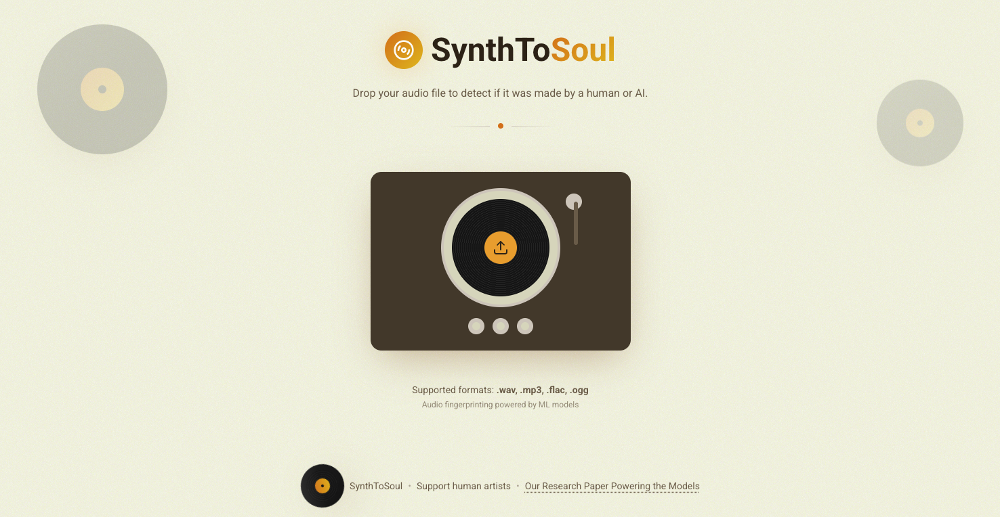

# SynthToSoul 💿🎶 (Human vs. AI Music Detector and Top-K Similar Songs Recommender)

Duration: November 2025 - January 2026

## Team Members
- Matt (Jiwoong) Park [mtp0326@seas.upenn.edu],
- Hassan Rizwan [hrizwan3@seas.upenn.edu],
- Stanley Liu [stanleey@seas.upenn.edu],
- Spencer Ware [wares@seas.upenn.edu]

## Contents
- [Overview](#overview)
- [Link to our Research Paper](#link-to-our-research-paper)
- [Video Demo](#video-demo)
- [Key Features](#key-features)
- [Tech Stack](#tech-stack)
- [How It Works](#how-it-works)
- [Installation](#installation)
- [Resources](#resources)

## Overview

<p float="left">
  
  
</p>

SynthToSoul is a full-stack audio analysis application designed to distinguish between **Human-Made** and **AI-Generated** music. By combining a custom Deep Learning classifier with audio fingerprinting technology, the system not only detects the origin of a track but also identifies real-world songs that sound similar to AI-generated uploads.

Our core backend uses a binary classification CNN trained on Mel spectrograms and Similarity Search algorithm through FAISS and KNN to find the top $k$ most similar human-made tracks based on cosine similarity of waveform embeddings and genre similarity. The dataset comes from the GTZAN dataset for Human-Made tracks and SONICS for AI-Generated tracks.

The code was previously moved from a private repository.

## Link to our Research Paper

**[PLEASE READ] Details to our core backend and ML models as well as performance results are provided in our paper [here](public/research_paper.pdf).**

## Video Demo

[](https://youtu.be/2JOW_FyJLlY)

## Key Features

*   **AI vs. Human Detection**: Uses a custom Convolutional Neural Network (CNN) trained on Mel spectrograms from GTZAN (human-made tracks) and SONICS (AI-generated tracks) datasets to classify audio files with high accuracy.
*   **Similarity Search**: If a song is flagged as AI-generated, the system uses **TorchOpenL3** embeddings and **FAISS** (Facebook AI Similarity Search) to find the top $k$ most similar human-made tracks from the GTZAN dataset.
*   **Interactive UI**: A polished, retro-vinyl themed interface built with React, featuring drag-and-drop file uploads, real-time status updates, and audio visualizations.
*   **Privacy-First**: Human-made tracks are deleted immediately after analysis to respect copyright and privacy; only AI tracks are temporarily processed for similarity matching.

## Tech Stack

### Backend
*   **Python & Flask**: RESTful API to handle file uploads and serve predictions.
*   **PyTorch**: Powers the custom CNN model (`AudioCNN`) for binary classification.
*   **Audio Processing**: `torchaudio` and `librosa` for spectrogram conversion.
*   **Similarity Engine**: `torchopenl3` for deep audio embeddings and `faiss` for efficient vector similarity search.
*   **Data Handling**: `pandas` and `numpy` for managing the SONICS and GTZAN dataset metadata and embeddings.

### Frontend
*   **React (Vite)**: Fast, modern frontend framework.
*   **TypeScript**: Ensures type safety and code maintainability.
*   **Tailwind CSS**: For responsive, modern styling.
*   **shadcn/ui**: High-quality, accessible UI components.
*   **Visualizations**: Custom vinyl and waveform animations.

## How It Works

1.  **Upload**: User drags and drops an audio file (`.wav`, `.mp3`, `.flac`, `.ogg`) into the DropZone.
2.  **Preprocessing**: The backend converts the audio into a Mel spectrogram tensor.
3.  **Classification**: The CNN model analyzes the spectrogram features to predict the probability of the track being AI-generated.
4.  **Action**:
    *   **Human-Made**: The user is notified, and the file is securely deleted.
    *   **AI-Generated**: The system generates an audio embedding and queries the FAISS index to find the nearest "real song" neighbors, displaying them as similar tracks.

## Page Results

### Song is AI-Generated


- Used an AI-Generated song "fake_54229_udio_0.mp3" from the SONICS dataset. The system runs the file through the CNN model and finds that it is AI-Generated through binary classification.


- After finding that the song is AI-Generated, the system generates an audio embedding using TorchOpenL3 and queries the FAISS index to find the Top-K nearest "real song" neighbors from the GTZAN dataset, displaying them as similar tracks.


### Song is Human-Made


- Used a human-made song "metal.00022.wav" ("Crazy Train" by Ozzy Osbourne) from the GTZAN dataset. The system runs the file through the CNN model and finds that it is Human-Made through binary classification.
- We then map the song to the helper dataframe containing the names of the songs and their artists can be assembled using the data provided by B.L. Sturm.

## Project Structure

```
├── backend/
│   ├── app.py              # Flask entry point & configuration
│   ├── routes.py           # API endpoints
│   ├── cnn_model.py        # PyTorch CNN architecture
│   ├── audio_search.py     # Similarity search engine (FAISS + TorchOpenL3)
│   ├── utils.py            # Audio processing utilities
│   ├── globals.py          # Shared state management
│   ├── models/             # Trained .pth models
│   └── csv/                # Dataset metadata
├── src/
│   ├── components/         # React components (DropZone, ResultsList, etc.)
│   ├── pages/              # Main views (Index, AIResults, HumanResults)
│   ├── hooks/              # Custom React hooks
│   └── lib/                # Utilities
└── public/                 # Static assets
```

## Installation

### Prerequisites
*   Node.js & npm
*   Python 3.11.14 (3.11.x)
*   (Optional) CUDA-enabled GPU for faster inference

### 1. Clone the Repository
```bash
git clone https://github.com/yourusername/sound-matcher.git
cd sound-matcher
```

### 2. Backend Setup
Create a virtual environment and install Python dependencies.

```bash
# Create virtual environment
python -m venv venv

# Activate virtual environment
# On macOS/Linux:
source venv/bin/activate
# On Windows:
# venv\Scripts\activate

# Install dependencies
pip install -r requirements.txt
```

> **Note**: For similarity search features, ensure you have the necessary model weights and index files in `backend/models/` and `backend/embeddings/`.

### 3. Frontend Setup
Install the Node.js dependencies.

```bash
npm install
```

## Running the Application

You can run both the frontend and backend concurrently (recommended) or separately.

### Concurrent Start

```bash
yarn dev
```

This command (configured in `package.json`) starts both the Vite dev server and the Flask backend.

### Manual Start

**Backend (Flask):**
```bash
source venv/bin/activate
python backend/app.py
```
The server will start at `http://localhost:8000`.

**Frontend (Vite):**
```bash
npm run dev:frontend
```
The app will be available at `http://localhost:5174/`.

## Resources

- SONICS dataset on Kaggle: `https://www.kaggle.com/datasets/awsaf49/sonics-dataset`  
- SONICS dataset on Hugging Face: `https://huggingface.co/datasets/awsaf49/sonics`  
- Article on AI music and streaming platforms (e.g., The Guardian):  
  `https://www.theguardian.com/technology/2025/nov/13/ai-music-spotify-billboard-charts`  
- OpenL3 GitHub repository: `https://github.com/marl/openl3`  
